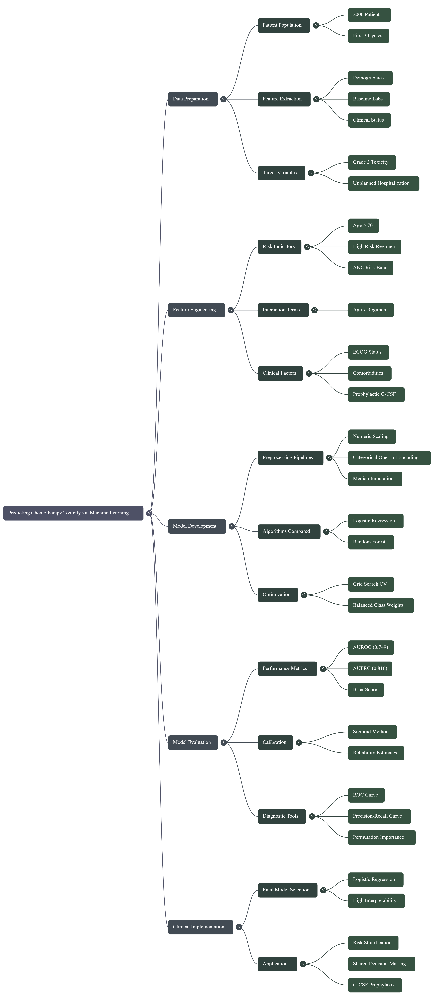

## Chemotherapy Toxicity Prediction via Machine Learning
**Project Overview**

This repository presents a predictive modeling pipeline designed to identify breast cancer patients at high risk for chemotherapy-induced toxicity. Using synthetic clinical data, the framework simulates patient demographics, laboratory values, and treatment regimens to predict severe side effects (Grade 3 toxicity) and unplanned hospitalizations.

The project compares Logistic Regression and Random Forest classifiers, ultimately selecting a calibrated Logistic Regression model for deployment. The model balances interpretability, calibration, and statistical accuracy, making it suitable for clinical decision support.

**Project Links**

- Interactive Demo: ChemotoxPredict Web App[https://chemotoxpredict.lovable.app/]

- Source Code Repository: VorCollective/AdML-Capstone[https://github.com/VorCollective/AdML-Capstone]

**Workflow**

Below is the end-to-end flowchart outlining the pipeline:




### Steps in the Workflow

**Data Preparation**

- Patient Population: 2,000 patients, first 3 cycles

- Feature Extraction: demographics, baseline labs, clinical status

- Target Variables: Grade 3 toxicity, unplanned hospitalization

**Feature Engineering**

- Risk Indicators: age > 70, high-risk regimen, ANC risk band

- Interaction Terms: age × regimen

- Clinical Factors: ECOG status, comorbidities, prophylactic G-CSF

**Model Development**

- Preprocessing Pipelines: numeric scaling, categorical one-hot encoding, median imputation

- Algorithms Compared: Logistic Regression, Random Forest

- Optimization: Grid Search CV, balanced class weights

**Model Evaluation**

- Performance Metrics: AUROC (0.749), AUPRC (0.816), Brier Score

- Calibration: sigmoid method, reliability estimates

- Diagnostic Tools: ROC curve, precision-recall curve, permutation importance

**Clinical Implementation**

- Final Model Selection: Logistic Regression (high interpretability)

- Applications: risk stratification, shared decision-making, G-CSF prophylaxis

**Synthetic Data Generation**

The dataset simulates 2,000 patients with realistic oncology parameters. Example snippet:

```
!python
n_patients = 2000
data = []

for pat in range(n_patients):
    age = np.random.randint(30, 86)
    regimen = np.random.choice(['Anthracycline-based', 'Taxane-based', 'CMF', 'Other'], p=[0.35, 0.40, 0.15, 0.10])
    baseline_anc = np.clip(np.random.normal(4.8, 1.4), 1.8, 8.5)
    # Toxicity probability adjusted by age, ECOG, ANC thresholds, and G-CSF use
    # Hospitalization probability correlated with toxicity
```
**Feature Engineering**

Features are aggregated at the patient level across cycles 1–3. Example snippet:

```
python
patient_df['age_gt_70'] = (patient_df['age'] > 70).astype(int)
patient_df['high_risk_regimen'] = patient_df['regimen_type'].isin(['Anthracycline-based', 'Taxane-based']).astype(int)
patient_df['age_x_regimen'] = patient_df['age'] * patient_df['high_risk_regimen']
```

# ANC risk band
```
patient_df['anc_risk_band'] = pd.cut(
    patient_df['baseline_neutrophils_10e9_L'],
    bins=[-np.inf, 1.5, 2.5, np.inf],
    labels=['<1.5', '1.5-2.5', '>2.5']
)
Model Architecture
Preprocessing
python
num_pipe = Pipeline([
    ('imputer', SimpleImputer(strategy='median', add_indicator=True)),
    ('scaler', StandardScaler())
])

cat_pipe = Pipeline([
    ('imputer', SimpleImputer(strategy='constant', fill_value='missing')),
    ('onehot', OneHotEncoder(handle_unknown='ignore'))
])

preprocessor = ColumnTransformer([
    ('num', num_pipe, numeric_features),
    ('cat', cat_pipe, categorical_features),
    ('bin', 'passthrough', binary_features)
])
```
**Algorithms**

Logistic Regression: Balanced class weights, saga solver, tuned C parameter

Random Forest: Balanced class weights, tuned n_estimators and max_depth

**Selection**

Both models achieved AUROC = 0.749. Logistic Regression was chosen for interpretability and better calibration.
Final calibrated model achieved:

- AUROC: 0.749

- AUPRC: 0.816

**Model Evaluation**

Evaluation helper function:

```
python
def evaluate_model(model, X_test, y_test, threshold=0.5):
    proba = model.predict_proba(X_test)[:,1]
    pred = (proba >= threshold).astype(int)
    tn, fp, fn, tp = confusion_matrix(y_test, pred).ravel()
    return {
        'auroc': roc_auc_score(y_test, proba),
        'auprc': average_precision_score(y_test, proba),
        'accuracy': accuracy_score(y_test, pred),
        'sensitivity': recall_score(y_test, pred),
        'precision': precision_score(y_test, pred),
        'specificity': tn / (tn + fp),
        'brier': brier_score_loss(y_test, proba)
    }
```

**Clinical Interpretation**

- Risk Stratification: AUROC ~0.75 indicates the model is clinically useful but should complement physician judgment.

- False Positive Management: AUPRC ~0.82 ensures clinicians are not overwhelmed with false alarms.

- Shared Decision-Making: Calibrated probabilities can guide prophylactic interventions (e.g., G-CSF administration).

**Deployment** 

- FastAPI REST API
- 
The model is deployed via FastAPI, enabling real-time predictions.

- Endpoint: /predict  
- Input: Patient data (JSON)
- Output: Predicted probability, risk label, interpretation

Example request:
```
json
POST /predict
{
  "age": 72,
  "ecog_performance_status": 2,
  "comorbidities_count": 3,
  "regimen_type": "Anthracycline-based",
  "prophylactic_gcsf": 1,
  "baseline_neutrophils_10e9_L": 2.1,
  "baseline_hemoglobin_g_dl": 11.5,
  "baseline_platelets_10e9_L": 250,
  "cumulative_dose_mg_m2": 120.0,
  "delta_neutrophils": -1.2,
  "menopausal_status": "Post",
  "er_positive": 1,
  "pr_positive": 0,
  "her2_positive": 0,
  "stage": "II",
  "anc_risk_band": "1.5-2.5",
  "age_gt_70": 1,
  "high_risk_regimen": 1,
  "age_x_regimen": 72
}
```
Example response:
```
json
{
  "predicted_probability": 0.68,
  "predicted_label": 1,
  "interpretation": "High risk"
}
```
**Installation & Usage**

- Clone the repository:

```
bash

git clone https://github.com/VorCollective/AdML-Capstone.git
cd AdML-Capstone
Install dependencies:

bash

pip install -r requirements.txt
```
Train the model:
```
bash
python train_pipeline.py
```
Run the API:
```
bash

uvicorn app:app --reload
```
**Future Directions**

- Integration with real-world clinical datasets

- Expansion to multi-cycle toxicity prediction

- Incorporation of genomic and biomarker data

- Deployment in clinical decision support systems
